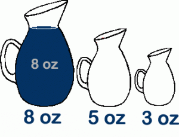
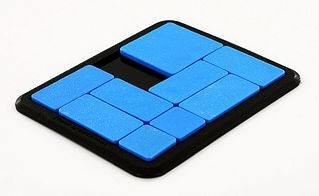

## Overview

A number of puzzles can be solved by either depth first search or breadth first search.

Both are easy to implement using `collections.deque()`.


## Generic Puzzle Solver

Here I present a generic puzzle solver that works on a broad class of puzzles.

The core idea is that we need very few things to describe the puzzle in a way that a solver can find a solution:

1. We need an initial position (the unsolved puzzle)
2. We need a rule (typically an iterator) to generate all possible moves from a position.
3. We need to recognize the goal state.

Optionally, we can provide some extras:

4. A nice `__repr__` method to display the puzzle position in a way recognizable to us.
5. A way to recognize that some positions are considered to be equivalent and don’t need to be explored twice (i.e. in tic-tac-toe, all four corner opening moves essentially describe the same).

## Jug Filling Problem

**Problem statement**: “Given a two empty jugs with 3 and 5 liter capacities and a full jug with 8 liters, find a sequence of pours leaving four liters in the two largest jugs.”



How to code it:

```python
from puzzle import Puzzle

class JugFill(Puzzle):
    '''Given a two empty jugs with 3 and 5 liter capacities and a full
       jug with 8 liters, find a sequence of pours leaving four liters
       in the two largest jugs.
    '''

    pos = (0, 0, 8)

    capacity = (3, 5, 8)

    goal = (0, 4, 4)

    def __iter__(self):
        for i in range(len(self.pos)):
            for j in range(len(self.pos)):
                if i==j: continue
                qty = min(self.pos[i], self.capacity[j] - self.pos[j])
                if not qty: continue
                dup = list(self.pos)
                dup[i] -= qty
                dup[j] += qty
                yield JugFill(tuple(dup))

if __name__ == '__main__':
    from pprint import pprint

    pprint(JugFill().solve())
```

How a puzzle instance works:

```python
>>> from pprint import pprint
>>> from jug_fill import JugFill
>>> p = JugFill()                # Make a fresh puzzle
>>> print(p)                     # Display the current position
(0, 0, 8)
>>> p.isgoal()                   # Are we at the goal state?
False
>>> for move in p:               # Display possible moves
...     print(move)
...
(3, 0, 5)
(0, 5, 3)
```

Running the `solve()` method immediately generate a solution:

```
[(0, 0, 8),
 (0, 5, 3),
 (3, 2, 3),
 (0, 2, 6),
 (2, 0, 6),
 (2, 5, 1),
 (3, 4, 1),
 (0, 4, 4)]
```

## Sliding Block Puzzle

**Problem statement**: “Slide blocks within a fixed grid so that the largest block ends-up in the lower left corner.”



How to code it:

```python
from puzzle import Puzzle
import re

class PaPuzzle(Puzzle):
    ''' PaPuzzle
    This sliding block puzzle has 9 blocks of varying sizes:
    one 2x2, four 1x2, two 2x1, and two 1x1.  The blocks are
    on a 5x4 grid with two empty 1x1 spaces.  Starting from
    the position shown, slide the blocks around until the
    2x2 is in the lower left:

        1122
        1133
        45
        6788
        6799
    '''

    pos = '11221133450067886799'

    goal = re.compile( r'................1...' )

    def isgoal(self):
        return self.goal.search(self.pos) != None

    def __repr__(self):
        ans = '\n'
        pos = self.pos.replace('0', '.')
        for i in [0, 4, 8, 12, 16]:
            ans = ans + pos[i:i+4] + '\n'
        return ans

    xlat = str.maketrans('38975','22264')

    def canonical(self):
        return self.pos.translate(self.xlat)

    block = { (0,-4), (1,-4), (2,-4), (3,-4),
              (16,4), (17,4), (18,4), (19,4),
              (0,-1), (4,-1), (8,-1), (12,-1), (16,-1),
              (3,1), (7,1), (11,1), (15,1), (19,1) }

    def __iter__(self):
        dsone = self.pos.find('0')
        dstwo = self.pos.find('0', dsone+1)
        for dest in [dsone, dstwo]:
            for adj in [-4, -1, 1, 4]:
                if (dest, adj) in self.block: continue
                piece = self.pos[dest+adj]
                if piece == '0': continue
                newmove = self.pos.replace(piece, '0')
                for i in range(20):
                    if 0 <= i+adj < 20 and self.pos[i+adj]==piece:
                        newmove = newmove[:i] + piece + newmove[i+1:]
                if newmove.count('0') != 2: continue
                yield PaPuzzle(newmove)

if __name__ == '__main__':
    from pprint import pprint

    pprint(PaPuzzle().solve())
```

Output:

```
[
1122
1133
45..
6788
6799
,

1122
1133
4.5.
6788
6799
,

 -- ... ---

7633
7622
1154
1199
..88
,

7633
7622
..54
1199
1188
]
```

## Core Logic

The only essential Python tool you need is `collections.deque()`, the double ended queue.

For a breadth first search, we pop an unexplored positions off of a deque. For each position, we generate the next possible moves and prepend them to the deque of unexplored move.

For a depth first search, we append rather than prepend.

To make it possible to replay the sequence of moves, we keep a trail dictionary that maps each move to its predecessor.

As an optimization, we call an optional user supplied canonical() method to see if the current position is equivalent to one that we’ve already explored.

```python
def solve(pos, depthFirst=False):
    queue = deque([pos])
    trail = {intern(pos.canonical()): None}
    solution = deque()
    load = queue.append if depthFirst else queue.appendleft

    while not pos.isgoal():
        for m in pos:
            c = m.canonical()
            if c in trail:
                continue
            trail[intern(c)] = pos
            load(m)
        pos = queue.pop()

    while pos:
        solution.appendleft(pos)
        pos = trail[pos.canonical()]

    return list(solution)
```

## Full Code for the Solver

```python
''' Generic Puzzle Solving Framework

License:  MIT
Author:   Raymond Hettinger

Simple Instructions:
====================

Create your puzzle as a subclass of Puzzle().
The first step is to choose a representation of the problem
state preferably stored as a string.  Set 'pos' to the starting
position and 'goal' to the ending position.  Create an __iter__()
method that computes all possible new puzzle states reachable from
the current state.  Call the .solve() method to solve the puzzle.

Important Note:

The __iter__() method must return a list or generator of puzzle
instances, not their representations.

Advanced Instructions:

1. .solve(depthFirst=1) will override the default breadth first search.
Use depth first when the puzzle known to be solved in a fixed number
of moves (for example, the eight queens problem is solved only when
the eighth queen is placed on the board; also, the triangle tee problem
removes one tee on each move until all tees are removed).  Breadth first
is ideal when the shortest path solution needs to be found or when
some paths have a potential to wander around infinitely (i.e. you can
randomly twist a Rubik's cube all day and never come near a solution).

2. Define __repr__ for a pretty printed version of the current position.
The state for the Tee puzzle looks best when the full triangle is drawn.

3. If the goal state can't be defined as a string, override the isgoal()
method.  For instance, the block puzzle is solved whenever block 1 is
in the lower left, it doesn't matter where the other pieces are; hence,
isgoal() is defined to check the lower left corner and return a boolean.

4. Some puzzle's can be simplified by treating symmetric positions as
equal.  Override the .canonical() method to pick one of the equilavent
positions as a representative.  This allows the solver to recognize paths
similar ones aleady explored.  In tic-tac-toe an upper left corner on
the first move is symmetrically equivalent to a move on the upper right;
hence there are only three possible first moves (a corner, a midde side,
or in the center).
'''

from collections import deque
from sys import intern
import re

class Puzzle:

    pos = ""                    # default starting position

    goal = ""                   # ending position used by isgoal()

    def __init__(self, pos=None):
        if pos: self.pos = pos

    def __repr__(self):         # returns a string representation of the position for printing the object
        return repr(self.pos)

    def canonical(self):        # returns a string representation after adjusting for symmetry
        return repr(self)

    def isgoal(self):
        return self.pos == self.goal

    def __iter__(self):         # returns list of objects of this class
        if 0: yield self

    def solve(pos, depthFirst=False):
        queue = deque([pos])
        trail = {intern(pos.canonical()): None}
        solution = deque()
        load = queue.append if depthFirst else queue.appendleft

        while not pos.isgoal():
            for m in pos:
                c = m.canonical()
                if c in trail:
                    continue
                trail[intern(c)] = pos
                load(m)
            pos = queue.pop()

        while pos:
            solution.appendleft(pos)
            pos = trail[pos.canonical()]

        return list(solution)
```
